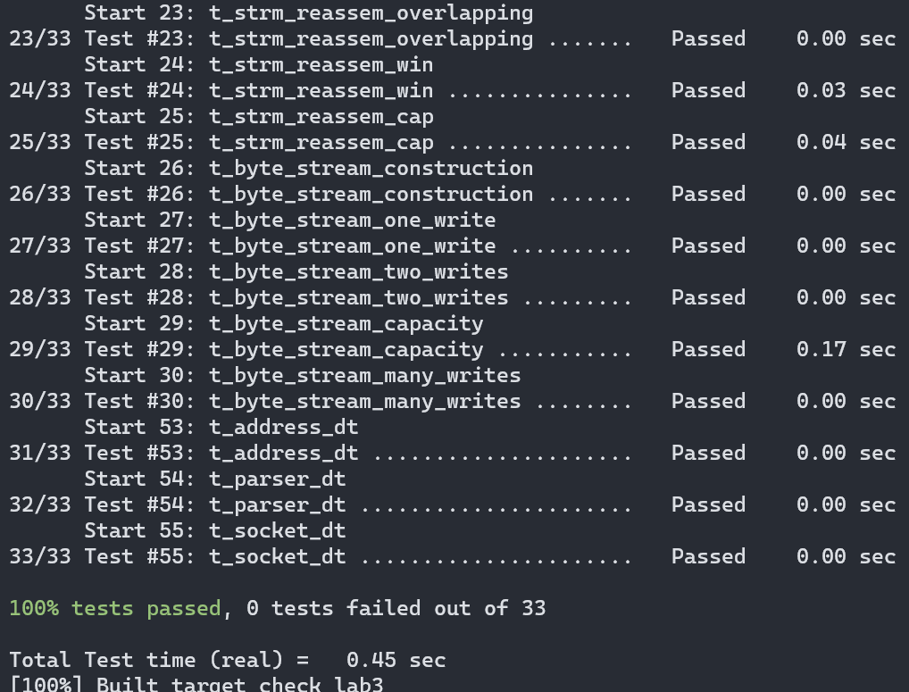

# CS144
This is my implementation for [CS144-F21](https://cs144.github.io/). I used to try to do the project, but I failed. I was not familiar with a lot of things at that time, including C++, computer network, design pattern, etc. So I refered to others' blog. I didn't copy their codes directly (though at last, I copied most of codes from the blogs and read through it to convince myself I'm not copying). But following others' idea all the time means I didn't really understand the conception. So I died at lab4. After that, I shelved the course for some months. Recently, I delete the original meaningless repository and try to implement again. I found, surprisingly, that the labs are not so difficult than I thought before. Many things get clear and the document is not obscure anymore. Maybe I make some progress on learning and coding, maybe I have learnt more knowledge. Anyway, I'm happy and proud that I can keep on doing this until I succeed.

## Lab0 - ByteStream
I implemented a `RingBuffer` as the underlying data structure of `ByteStream`. It's more efficient than use a `vector` to store a lot of data segments. And this simplifies the implementation of `ByteStream`.

## Lab1 - Reassembler

## Lab2 - Receiver

## Lab3 - Sender

## Lab4 - TCPConnection
It's the most difficult part of all the labs. There are a lot of corner cases. I feel a little ashamed (though as some people pointed out, it may be unnecessary) because I used _test case oriented programming_ to complete some parts of code. Besides, I realized the advantage of _defensive programming_. Use `assert` as many as possible can help us find the problems earlier.

I have some questions on the test. I can't pass tcp_ipv4 tests on my Ubuntu, all because of timeout, but other tests are fine. And I can pass all the tests on my WSL, except CS144 version of webget. Again, it's because of timeout. I believe it's not caused by my implementation because I passed all the tests. But I haven't figured out what goes wrong.

## Lab5 - Network Interface

## Lab6 - Router

# Official document
For build prereqs, see [the CS144 VM setup instructions](https://web.stanford.edu/class/cs144/vm_howto).

## Sponge quickstart

To set up your build directory:

	$ mkdir -p <path/to/sponge>/build
	$ cd <path/to/sponge>/build
	$ cmake ..

**Note:** all further commands listed below should be run from the `build` dir.

To build:

    $ make

You can use the `-j` switch to build in parallel, e.g.,

    $ make -j$(nproc)

To test (after building; make sure you've got the [build prereqs](https://web.stanford.edu/class/cs144/vm_howto) installed!)

    $ make check_labN *(replacing N with a checkpoint number)*

The first time you run `make check_lab...`, it will run `sudo` to configure two
[TUN](https://www.kernel.org/doc/Documentation/networking/tuntap.txt) devices for use during
testing.

### build options

You can specify a different compiler when you run cmake:

    $ CC=clang CXX=clang++ cmake ..

You can also specify `CLANG_TIDY=` or `CLANG_FORMAT=` (see "other useful targets", below).

Sponge's build system supports several different build targets. By default, cmake chooses the `Release`
target, which enables the usual optimizations. The `Debug` target enables debugging and reduces the
level of optimization. To choose the `Debug` target:

    $ cmake .. -DCMAKE_BUILD_TYPE=Debug

The following targets are supported:

- `Release` - optimizations
- `Debug` - debug symbols and `-Og`
- `RelASan` - release build with [ASan](https://en.wikipedia.org/wiki/AddressSanitizer) and
  [UBSan](https://developers.redhat.com/blog/2014/10/16/gcc-undefined-behavior-sanitizer-ubsan/)
- `RelTSan` - release build with
  [ThreadSan](https://developer.mozilla.org/en-US/docs/Mozilla/Projects/Thread_Sanitizer)
- `DebugASan` - debug build with ASan and UBSan
- `DebugTSan` - debug build with ThreadSan

Of course, you can combine all of the above, e.g.,

    $ CLANG_TIDY=clang-tidy-6.0 CXX=clang++-6.0 .. -DCMAKE_BUILD_TYPE=Debug

**Note:** if you want to change `CC`, `CXX`, `CLANG_TIDY`, or `CLANG_FORMAT`, you need to remove
`build/CMakeCache.txt` and re-run cmake. (This isn't necessary for `CMAKE_BUILD_TYPE`.)

### other useful targets

To generate documentation (you'll need `doxygen`; output will be in `build/doc/`):

    $ make doc

To format (you'll need `clang-format`):

    $ make format

To see all available targets,

    $ make help
